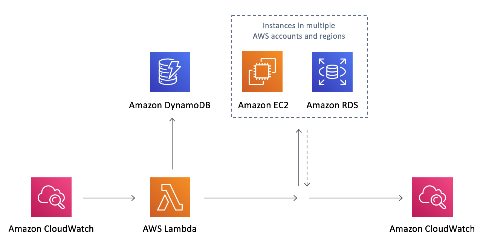

# AWS Instance Scheduler

English in Front and Chinese after

英文在前，中文在后

## Solution Overview
https://aws.amazon.com/solutions/instance-scheduler/

Amazon Web Services (AWS) offers cloud resource on demand so that customers can control their resource capacity and pay as you go. One approach to reduce costs is to stop resources that are not in use, and start those resources when their capacity is needed.

The AWS Instance Scheduler is a solution that enables customers to easily configure custom start and stop schedules and automates the starting (when resources capacity is needed) and stopping
(resources that are not in use) of Amazon Elastic Compute Cloud (Amazon EC2) and Amazon Relational Database Service (Amazon RDS) instances.

The Instance Scheduler leverages AWS resource tags and AWS Lambda function to automatically stop and restart instances across multiple AWS Regions and accounts on a customer-defined schedule which stored in Amazon DynamoDB. An Amazon CloudWatch event triggers an AWS Lambda function that checks the current state of each appropriately tagged instance and execute the action based on schedule.

The Lambda function also records the name of the schedule, the instances associated with that schedule, and the status of instances in Amazon DynamoDB.

## 方案概述
Amazon Web Services（AWS）按需提供云资源，以便客户可以控制其资源容量并随需付费。降低成本的一种方法是停止未使用的资源，并在需要其容量时启动这些资源。

AWS Instance Scheduler 是其中一种解决方案，可让客户轻松配置自定义启动和停止时间表并自动启动（需要资源容量时）和停止
（未使用的资源）Amazon Elastic Compute Cloud（Amazon EC2）和 Amazon Relational Database Service（Amazon RDS）实例。

AWS Instance Scheduler 利用AWS资源标签和 AWS Lambda 函数自动按照存储在 Amazon DynamoDB 中的客户定义的时间计划表对跨多个AWS区域和多个账户的实例进行停止和重启。 Amazon CloudWatch 事件触发一个 AWS Lambda 函数，该函数检查每个带有适当标签的实例的当前状态, 并执行计划表中的动作。

Lambda 函数还在 Amazon DynamoDB 中记录时间计划表的名称，与该时间计划表关联的实例以及实例的状态。




## This repository Description

Scheduler for Cross-Account and Cross-Region scheduling for EC2 and RDS instances
This repo is forked from https://github.com/awslabs/aws-instance-scheduler and made update for china region based on v1.3.0 version. The contents including:
1. Generate the AWS Instance Scheduler Cloudformation template
2. Package the Lambda function code of AWS Instance Scheduler
3. Upload the artifacts to user specified S3 bucket.

## 该代码仓库描述
用于EC2和RDS实例的跨帐户和跨区域调度的按计划启停调度。
此存储库来自 https://github.com/awslabs/aws-instance-scheduler 并基于v1.3.0版本在中国区域进行了更新。 包括一下内容：
1. 生成 AWS Instance Scheduler Cloudformation 模板
2. 打包 AWS Instance Scheduler Lambda 函数代码
3. 上传 构件到用户指定的 S3 桶。

## Setup 部署
Generate Cloudformation template via makefile

通过Makefile生成的Cloudformation模板进行部署
1. You can git clone this repo 

   你可以git克隆这个仓库

2. run make command, you can specify your {s3_bucket} and {region} 

   运行make命令，您可以指定{s3_bucket}和{region}

3. Make sure the aws cli, pip, zip command and pytz liberary have been installed on your machine

   确保你的运行机器安装了 aws cli, pip, zip 命令 以及 pytz库

4. The setup commands have been verified on Amazon Linux, Ubuntu, MacOS

   编译命令在 Amazon Linux, Ubuntu, MacOS 环境下验证通过

```bash
# git clone
git clone https://github.com/liangruibupt/aws-instance-scheduler
cd aws-instance-scheduler/source/code/

# Install pytz (安装 pytz 库)
pip install pytz
pytz_location=$(pip show pytz | grep Location | cut -d':' -f 2 | tr -d " ")
cp -r ${pytz_location}/pytz .

# Build
## define variable or specify the value of bucket, solution, version, region
## 定义下列变量：bucket, solution, version, region
export bucket=YOUR_S3_BUCKET //This bucket must unique 该S3桶必须唯一
export solution=THE_SOLUTION_NAMING
export version=THE_VERSION
export region=THE_REGION_OF_S3_BUCKET_LOCATED
make bucket=${bucket} solution=${solution} version=${version} region=${region}
## for example: make bucket=solutions-scheduler solution=aws-instance-scheduler version=v1.3.0 region=cn-northwest-1

# set s3 bucket PublicAccessBlock configuration, make sure you use upgrade your aws cli > 1.18
# 通过 aws cli (版本建议 1.18以上)设置 S3 桶 PublicAccessBlock 配置
aws s3api put-public-access-block \
    --bucket ${bucket} \
    --public-access-block-configuration "BlockPublicAcls=false,IgnorePublicAcls=true,BlockPublicPolicy=true,RestrictPublicBuckets=true" --region ${region}

# Deploy
make deploy bucket=${bucket} solution=${solution} version=${version} region=${region}
# for example: make deploy bucket=solutions-scheduler solution=aws-instance-scheduler version=v1.3.0 region=cn-northwest-1

# Delete pytz (删除 pytz 库)
rm -r pytz
```

## What's result the build and deploy successfully excuted? （编译和部署成功执行了哪些动作？）
- A new S3 bucket ${bucket}-${region} will be automatically created if it is not existed
- 如果S3存储桶不存在，那么新的S3存储桶 ${bucket}-${region} 将会被创建
- The resources will be automatically uploaded to s3://${bucket}-${region}/${solution}/${version}/
- 资源将自动上传到 s3://${bucket}-${region}/${solution}/${version}/
- The S3 bucket public access block policy as: BlockPublicAcls=false,IgnorePublicAcls=true,BlockPublicPolicy=true,RestrictPublicBuckets=true
- S3存储桶公共访问阻止策略为：BlockPublicAcls = false，IgnorePublicAcls = true，BlockPublicPolicy = true，RestrictPublicBuckets = true

## Refer below document to create cloudformation stack and execute testing 
参考下列文档部署 Cloudformation 和 执行相关测试

[测试效果](Testing.md)


***

Copyright 2019 Amazon.com, Inc. or its affiliates. All Rights Reserved.

Licensed under the Apache License Version 2.0 (the "License"). You may not use this file except in compliance with the License. A copy of the License is located at

    http://www.apache.org/licenses/

or in the "license" file accompanying this file. This file is distributed on an "AS IS" BASIS, WITHOUT WARRANTIES OR CONDITIONS OF ANY KIND, express or implied. See the License for the specific language governing permissions and limitations under the License.
