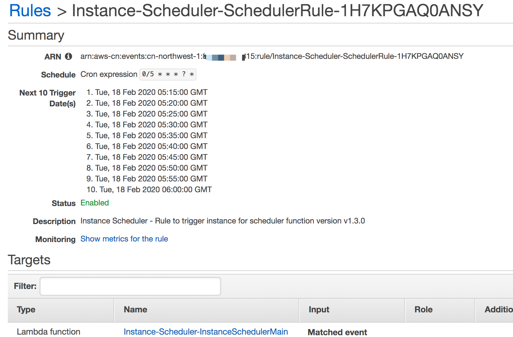
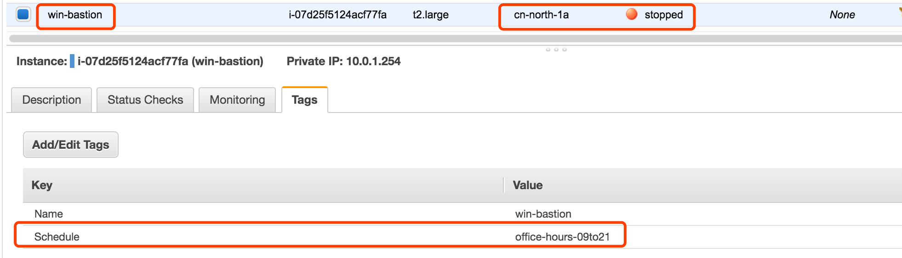
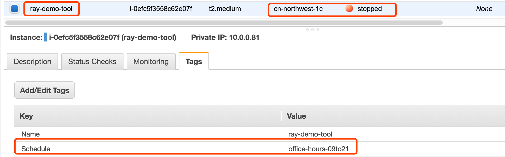
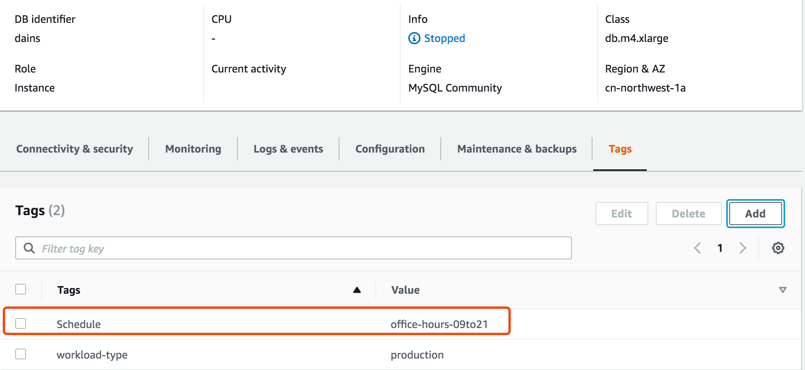
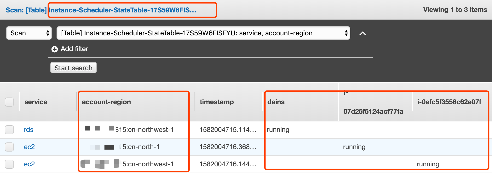
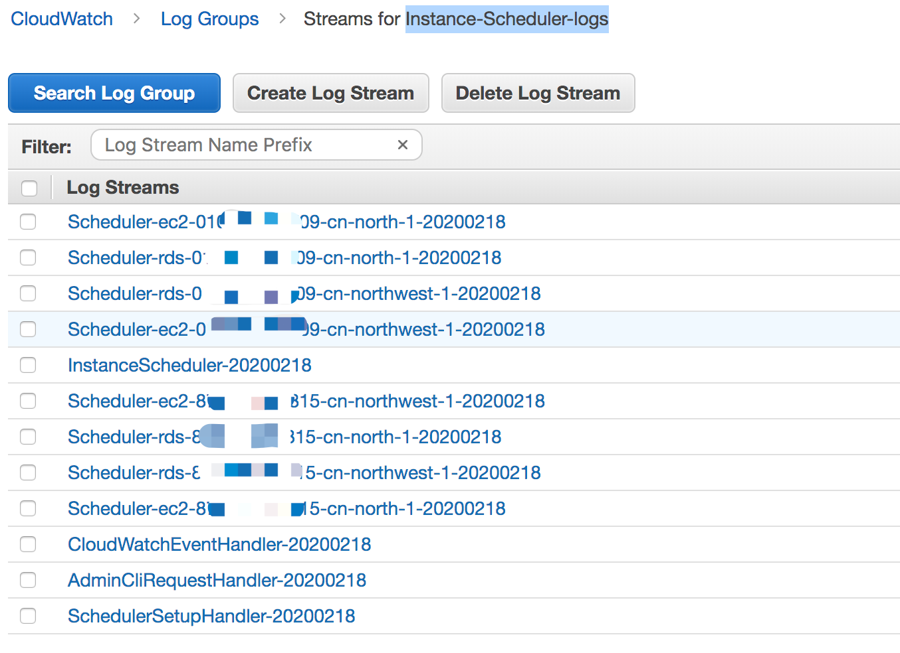
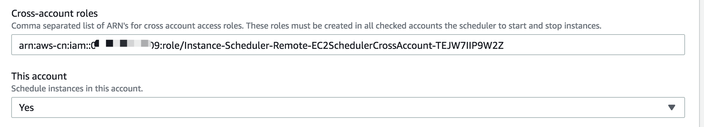
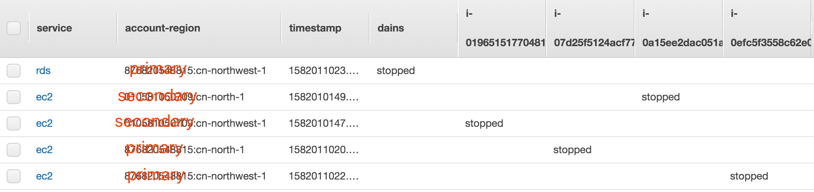
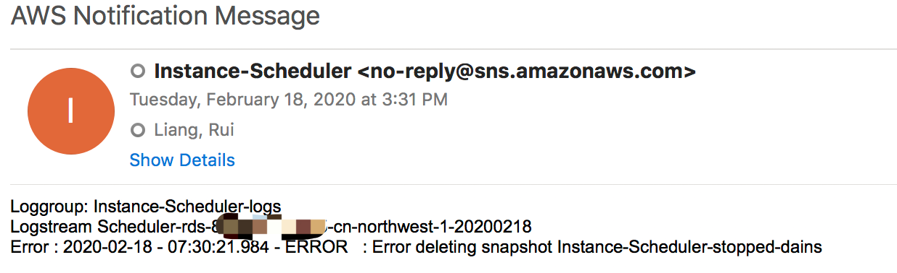

# 测试样例

## Step 1. Launch the Instance Scheduler Stack （部署CloudFormation模板）
1. Refer to the Setup link in the README Make CloudFormation

    参考README中的Setup环节Make CloudFormation

2. Your CloudFormation tempalte will be stored in 

    您的CloudFormation模板将存储在
    - Primay Account tempalte 主账号模板

    s3://$(bucket)-$(region)/$(solution)/$(version)/instance-scheduler.template

    - Secondary A ccount templete 隶属账号模板

    s3://$(bucket)-$(region)/$(solution)/$(version)/instance-scheduler-remote.template

3. Copy the http url of your instance-scheduler.template

    获取该instance-scheduler.template的http url

    For example: 
    https://solutions-scheduler-cn-northwest-1.s3.cn-northwest-1.amazonaws.com.cn/aws-instance-scheduler/v1.3.0/instance-scheduler.template

4. Use above http url of instance-scheduler.template to launch CloudFormation stack

    使用上述template的http url创建CloudFormation stack

5. After CloudFormation stack complete, check Cloudwatch Scheduler

    创建完毕，检查Cloudwatch Scheduler



## Step 2 Configure Periods (配置Periods)

1. Install the scheduler cli （安装scheduler cli）
    详情参考：
    https://docs.aws.amazon.com/solutions/latest/instance-scheduler/appendix-a.html

```bash
# install 安装
sudo python setup.py install
OR
python setup.py install
```

2. how to use 使用说明
```bash
scheduler-cli <command> <arguments>
{create-period,create-schedule,delete-period,delete-schedule,describe-periods,describe-schedule-usage,describe-schedules,update-period,update-schedule}
```

3. Example, 参考样例：创建一个周一到周五，早上9点到21点的period
```bash
# The {stack} is the cloudformation primary stack name, {profile} is the aws cli profile name
scheduler-cli create-period --stack Instance-Scheduler --name office-hours-09to21 --weekdays mon-fri --begintime 9:00 --endtime 21:00 --region cn-northwest-1 --profile cn-north-1
```

## Step 3. Configure Schedules (配置Schedules)

详情参考：
https://docs.aws.amazon.com/solutions/latest/instance-scheduler/appendix-a.html

1. Create schedule and attach the periods (创建schedule,将需要的period添加到schedule中)
```bash
# The {stack} is the cloudformation primary stack name, {profile} is the aws cli profile name
# The {periods} is the periods name created by create-period command
scheduler-cli create-schedule --stack Instance-Scheduler --name office-hours-09to21 --periods office-hours-09to21 --timezone Asia/Shanghai --region cn-northwest-1 --profile cn-north-1

# check result
scheduler-cli describe-schedules --stack Instance-Scheduler --region cn-northwest-1 --profile cn-north-1
```

## Step 4. Tag Your Instances (给需要纳入管理的EC2和RDS打标签)

1. Tag Your Instances (给需要纳入管理的EC2和RDS打标签)

    For the Instance Scheduler to recognize an Amazon EC2 or Amazon RDS instance, the tag key on that instance must match the custom tag name stored in the Amazon DynamoDB table. The default tag is Schedule
    For example, to apply office-hours-09to21 schedule to instances, add the Schedule=office-hours-09to21 tag to the instances. 

    为了使实例计划程序能够识别Amazon EC2或Amazon RDS实例，该实例上的Tag必须与存储在Amazon DynamoDB表中的自定义Tag名称匹配。
    例如，要将office-hours-09to21时间表应用于实例，请将Schedule = office-hours-09to21 Tag 添加到实例。默认的Tag是Schedule

北京区EC2示例


宁夏区EC2示例


RDS示例



## Step 5. Check result 检查结果
    
> Check the tagged ec2 instance and non-tagged ec2 instance start/stop as expected

> 检查标记的ec2实例和未标记的ec2实例是否按预期方式启动/停止

1. DynamoDB Table记录示例状态


2. Check status 检查示例状态，与DynamoDB Table记录一致

```bash
aws ec2 describe-instance-status --instance-ids i-0efc5f3558c62e07f --query 'InstanceStatuses[*].{InstanceId:InstanceId,Status:InstanceState.Name,AZ:AvailabilityZone}' \
> --output table --region cn-northwest-1 --profile cn-north-1
-------------------------------------------------------
| DescribeInstanceStatus |
+------------------+-----------------------+----------+
| AZ | InstanceId | Status |
+------------------+-----------------------+----------+
| cn-northwest-1c | i-0efc5f3558c62e07f | running |
+------------------+-----------------------+----------+
```
```bash
aws ec2 describe-instance-status --instance-ids i-07d25f5124acf77fa --query 'InstanceStatuses[*].{InstanceId:InstanceId,Status:InstanceState.Name,AZ:AvailabilityZone}' \
> --output table --region cn-north-1 --profile cn-north-1
---------------------------------------------------
| DescribeInstanceStatus |
+--------------+-----------------------+----------+
| AZ | InstanceId | Status |
+--------------+-----------------------+----------+
| cn-north-1a | i-07d25f5124acf77fa | running |
+--------------+-----------------------+----------+
```
```bash
aws rds describe-db-instances --db-instance-identifier dains --query 'DBInstances[*].{InstanceId:DBInstanceIdentifier,Type:Engine,Status:DBInstanceStatus,URL:Endpoint.Address}' \
> --output table --region cn-northwest-1 --profile cn-north-1
------------------------------------------------------------------------------------------------
| DescribeDBInstances |
+------------+------------+--------+-----------------------------------------------------------+
| InstanceId | Status | Type | URL |
+------------+------------+--------+-----------------------------------------------------------+
| dains | available | mysql | dains.xxxxx.rds.cn-northwest-1.amazonaws.com.cn |
+------------+------------+--------+-----------------------------------------------------------+
```

3. You can check the cloudwatch log group Instance-Scheduler-logs for each scheduled instance details

    您可以检查cloudwatch日志组Instance-Scheduler-logs中每个已调度实例的详细信息
    
    Cloudwatch log group
    


## Step 6. Launch the Remote Stack in Secondary Accounts (Optional) 跨账号管理（可选）

1. Primary account: Copy the Value of SchedulerRole in Primary Stack Resource

    主帐户：在主堆栈资源中复制SchedulerRole的值

2. Secondary accounts: 

    2.1. Launch the remote template (instance-scheduler-remote) in each applicable secondary account.
    
    辅助帐户：在每个适用的Secondary帐户中启动远程模板（instance-scheduler-remote）。

    2.2 Enter the account number of the account with the primary Instance Scheduler stack. 
    
    输入具有主实例计划程序堆栈的帐户的帐号。

    2.3 Copy cross-account role Amazon Resource Name (ARN) in Outputs
    
    拷贝输出中的 cross-account role Amazon Resource Name (ARN)

3. Primary account: Update the Primary stack with each cross-account role ARN by entering the appropriate ARN(s) in the Cross-account roles parameter

    主账号： 通过在“Cross-account roles”参数中输入上述ARN，允许多个输入。




4. Tag the EC2 and RDS resource in secondary account with scheduler tag

    在secondary帐户中标记EC2和RDS资源

5. Testing 测试 

    5.1 launch EC2 instance in secondary account (both cn-north-1 and cn-northwest-1 region) 

    在辅助帐户（cn-north-1和cn-northwest-1地区）中启动EC2实例

    5.2 modify the period which let scheduler stop all started instance for both primary and secondary account

    修改使调度程序停止主帐户和辅助帐户的所有已启动实例

    ```bash
    scheduler-cli update-period --stack Instance-Scheduler --name office-hours-09to21 --weekdays mon-fri --begintime 9:00 --endtime 15:15 --region cn-northwest-1 --profile cn-north-1
    ```

    5.3 verify the instances stopped 验证示例均被停止




## Step 6. Define the SNS subscription for notification any scheduler error (定义SNS订阅以通知任何调度程序错误)

    Add a subscription to the SNS Topic in the CloudFormation stack output for exception notification
    
    给CloudFormation stack输出中的SNS Topic添加subscription，用于异常通知



## Step 7. Cleanup 清理
You can delete the CloudFormation stack once your complete testing

测试完毕，您可以根据需要删除 CloudFormation stack 